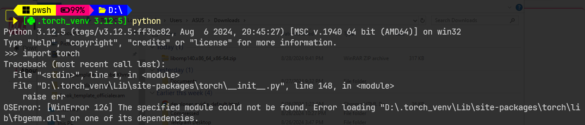

# Problem Statement

I have just install the latest stable version of PyTorch 2.4.0 with Python 3.12.5. PyTorch complains the following statement:

# Solution

Download the dependency `libomp140.x86_64.dll`

from the following link:

[https://www.dllme.com/dll/files/libomp140_x86_64/00637fe34a6043031c9ae4c6cf0a891d/download](https://www.dllme.com/dll/files/libomp140_x86_64/00637fe34a6043031c9ae4c6cf0a891d/download)

Place the download file to the directory where the `fbgemm.dll` lives.

In my case, `D:\.torch_venv\Lib\site-packages\torch\lib\fbgemm.dll`